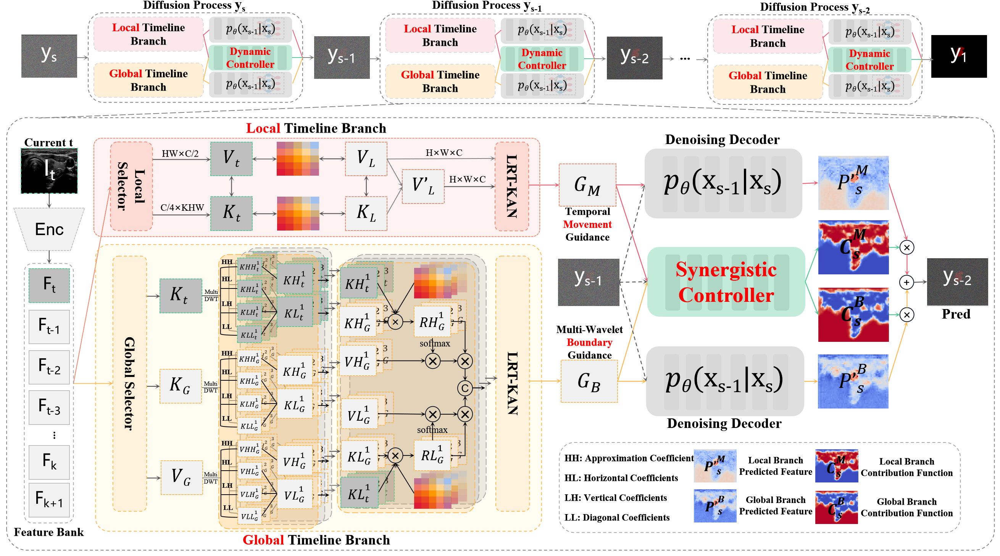
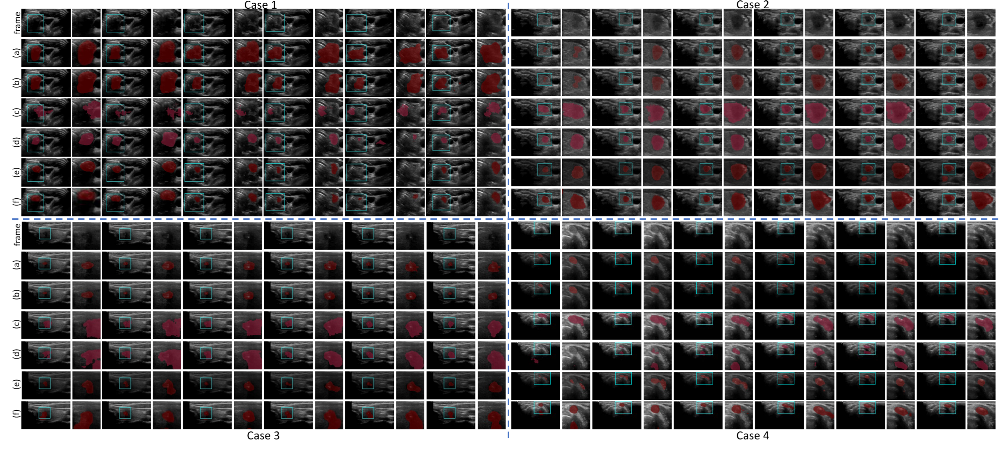

# USVTNS

# The dataset and code are currently for demonstration purpose only.

# The complete dataset and the code will be publicly available after the paper is published in this repository.

## Visual comparison results with SOTA methods

